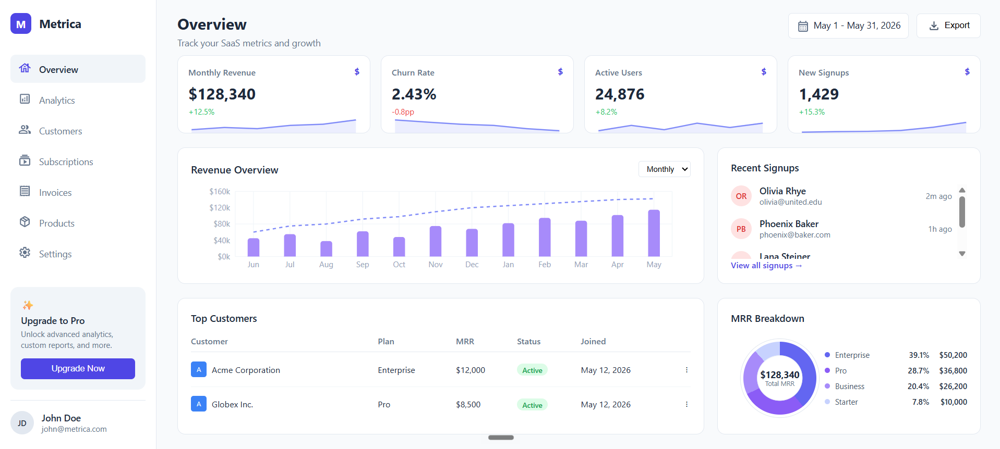

# Metrica SaaS Dashboard

> A modern, responsive SaaS admin dashboard built with React, Recharts, and vanilla CSS. Designed for tracking key business metrics, managing customers, subscriptions, invoices, and more.

---



## 🚀 Live Demo

Check out the live version of the dashboard here:

👉 **[metrica-dashboard.vercel.app](https://metrica-dashboard.vercel.app)**

---

## 📋 Features

- **Overview Page** – KPI cards, revenue chart, sparklines, recent signups, and MRR breakdown.
- **Analytics Page** – Deep-dive metrics, traffic sources, and event tracking.
- **Customers Page** – Searchable, filterable customer table with status badges.
- **Subscriptions Page** – Active subscription ledger with billing cycles and next billing dates.
- **Invoices Page** – Invoice table with statuses, outstanding balance doughnut chart, and recent payments list.
- **Products Page** – Clean pricing card layout with feature lists and subscriber counts.
- **Settings Page** – Fully interactive tabs for General, Profile, Billing, Team, Notifications, and Security.
- **Mobile Responsive** – Fully adaptable layout for tablets and mobile phones.
- **No external CSS frameworks** – Built entirely with vanilla CSS.

---

## 🛠️ Built With

- **React** – Component-based UI architecture
- **Recharts** – Interactive charts and sparklines
- **React Router** – Seamless page navigation
- **Vanilla CSS** – Custom, lightweight styling
- **SVG Icons** – Clean, scalable vector icons

---

## 📦 Installation & Usage

1. **Clone the repository:**
   ```bash
   git clone https://github.com/abedoulaye/metrica-dashboard
   cd metrica-dashboard
   ```
